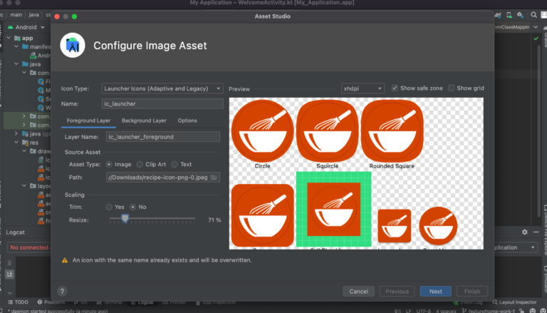
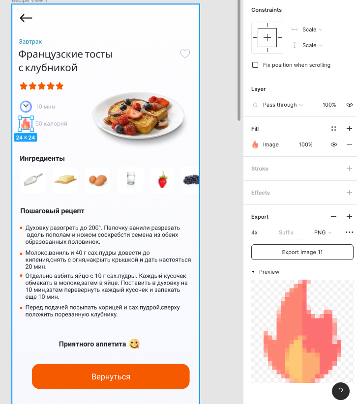

# Введение, создание Android-проекта в AndroidStudio
✅ Учимся делать сетевые запросы и получать ответ от сервера.

## В результате:

- Изучите основы работы c Android Studio. Узнаете где хранятся строковые ресурсы, иконки и цвета.

### 🎯 Цели домашнего задания:
- Изучить основы работы в Android Studio
- Научиться создавать Android-проекты.
- Понимать где находятся ресурсы, цвета, строки
- Изучить структуру проекта
- Изучить build.gradle.kts – файл
- Понять что такое AndroidManifest.xml
- Рассмотреть файлы верстки
- Научиться создавать эмулятор или подключить девайс в режиме разработчика
- Научиться работать с Android Log для поиска и логирования ошибок

### 📚 Задание:

Создать проект в Android Studio. Добавить необходимые ресурсы для отображения в пользовательском интерфейсе: иконки, строки, цвета.

### 📚 Подробный план.

- Создать пустой проект. New Project -> Empty Activity
- Изменить название приложения на любое которое вам нравится (Например “Мои рецепты”). (Название приложения можно посмотреть в AndroidManifest.xml)
- Изменить иконку приложения. Иконку приложения нужно экспортировать из Figma. Сделать это можно через File -> New -> Image Asset. Указать путь где находится файл и поиграться со значением Resize чтобы выглядело примерно как на картинке.

- • Импортировать строки из макетов. Строки (например “Что будете готовить сегодня?”,  “Популярные рецепты” и так далее). Повторять строки не нужно (Например строка “Завтрак” должна быть одна.) На скриншоте ниже выделены строки, которые нужно создать в ресурсах в файле strings.xml

- - Создать переводы на английский язык для строк, которые используются в интерфейсе приложения (Строки для нижнего меню, Рекомендуем, Еще, Начните поиск, Популярные рецепты, Вернуться). Подсказка https://developer.android.com/guide/topics/resources/localization#creating-alternatives
- Импортировать цвета из макетов. Оранжевый, белый. серый, темно-серый.
- Импортировать иконки и изображения блюд в Android-проект. Для этого дважды кликнуть на изображение и выбрать кнопку Export. После этого добавить сохраненную иконку в папку drawables в Android-проекте.

- Создать WelcomeActivity и сделать ее стартовой (прописать intent-filter Main).
- Скопировать xml верстку и вставить в файл activity_welcome.xml
- Добавить библиотеку Timber в build.gradle и залогировать методы onCreate() в экранах Activity. [Ccылка](https://github.com/JakeWharton/timber)
- Выполнить команды git commit -m “Добавлены ресурсы и Activity”. (Перед этим не забудьте создать новую ветку feature/home-work-1 и переключиться на нее через git checkout ИмяВетки)
- Запушить на удаленный репозиторий (git push origin feature/home-work-1)
- Создать Pull Request как показано в уроке
- Прислать ссылку на Pull Request
- [Пройти опрос по ссылке](https://forms.gle/eoLA5gRiwdNgQe7q7)

### 📚 Полезные материалы:

- [Скачать Android Studio](https://developer.android.com/studio)
- [Макет Figma](https://www.figma.com/file/EuMJwD2kFAD9SO9bcnY7Sg/Android-Basic-Demo?node-id=1%3A144)
- [Android App Bundle](https://xakep.ru/2021/07/06/apk-to-aab/)
- [Android изнутри (Dalvik и ART)](https://habr.com/ru/post/513928/)
- [AndroidManifest](https://developer.android.com/guide/topics/manifest/manifest-intro)
- [Опрос о занятии](https://forms.gle/eoLA5gRiwdNgQe7q7)

