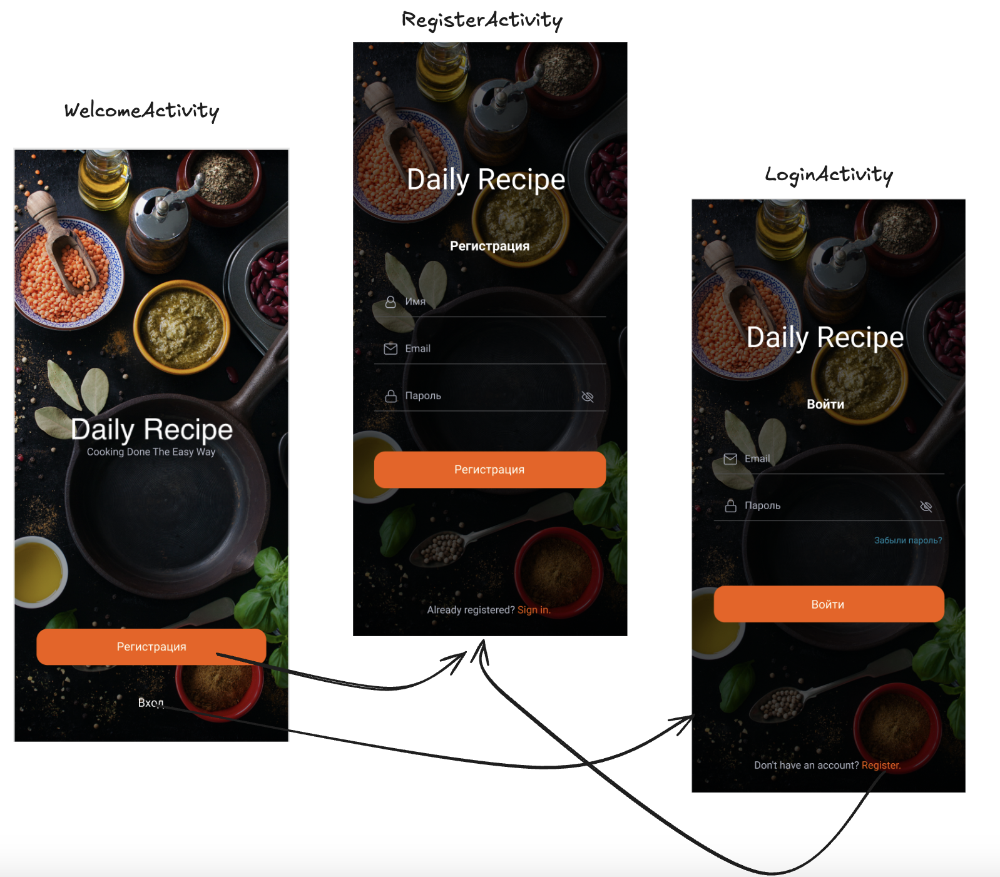
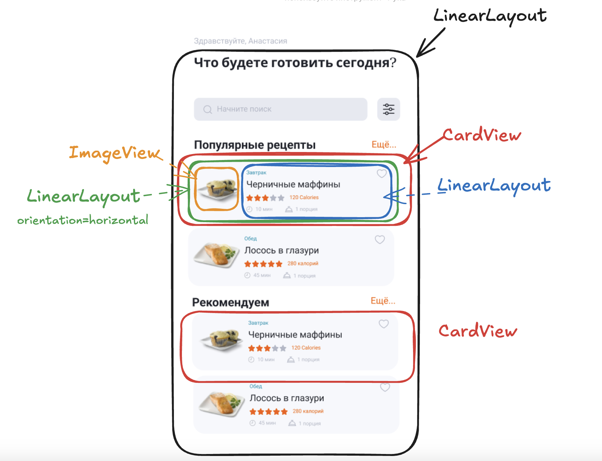

### 🎯 Цели домашнего задания:

Ознакомиться с Activity и жизненным циклом Activity, научиться верстать простые экраны

- Научиться создавать Activity
- Научиться верстать UI с помощью основных UI - виджетов
- Понимать разницу между различными видами Layout
- Добавлять обработку нажатия/ввода текста виджетам

### 📝  Домашнее задание

- Создать WelcomeActivity и сделать ее стартовой.

  Для этого необходимо проверить что новая Activity добавлена в AndroidManifest.xml и прописать intent-filter Main в AndroidManifest.xml

  Как создать Activity можно дополнительно прочитать здесь

  https://startandroid.ru/ru/uroki/vse-uroki-spiskom/58-urok-21-sozdanie-i-vyzov-activity.html

  https://stackoverflow.com/questions/16641643/how-to-add-new-activity-to-existing-project-in-android-studio

  Сверстать макет как показано в примере

  Когда пользователь нажимает кнопку Регистрация - переход на новую Activity, которая называется RegisterActivity. Этот код необходимо разместить в методе button.setOnClickListener{}

    ```kotlin
    val a = Intent(this.context, RegisterActivity::class.java)
            startActivity(a)
    ```

  Когда пользователь нажимает кнопку Войти - переход на новую Activity, которая называется LoginActivity. Этот код необходимо разместить в методе button.setOnClickListener{}

    ```kotlin
    val a = Intent(this.context, LoginActivity::class.java)
            startActivity(a)
    ```

- Создать RegisterActivity и сверстать соответствующий макет.
- Создать LoginActivity и сверстать макет.
- Добавить библиотеку Timber в build.gradle и залогировать методы onCreate() в экранах Activity. Ccылка https://github.com/JakeWharton/timber

Итоговый результат показан на схеме:


📌 Сверстать дизайн карточек рецептов на главном экране, используя рассмотренные виджеты (LinearLayouts, RelativeLayouts, Checkbox, CardView, TextView, ImageView etc)

Создать чекбокс в виде сердечка, логировать при нажатии на CheckBox статус (true/false)

📌 Создать отдельную Activity, назвать DetailedActivity и сверстать макет для отображения детальной информации о рецепте.

Итоговый результат показан на схеме:


### 📝  Подсказки для верстки

Схема верстки главного экрана


Схема верстки ячейки рецепта


### 📚 Полезные материалы:

- Timber https://github.com/JakeWharton/timber
- **Памятка по жизненному циклу Android — часть I.** https://habr.com/ru/articles/569092/
- Документация по **жизненному циклу Activity** https://developer.android.com/reference/android/app/Activity#ActivityLifecycle
- Документация по стилям https://developer.android.com/develop/ui/views/theming/themes#Styles
- Отличная статья про стили и темы в Android https://habr.com/ru/companies/redmadrobot/articles/461201/
- Стили Material https://m2.material.io/components/text-fields/android#theming-text-fields
- ShapeableImageView
- https://www.howtodoandroid.com/shapeableimageview-material-components-android/
- Добавление selectors https://stackoverflow.com/questions/3192173/change-icons-of-checked-and-unchecked-for-checkbox-for-android/3193127#3193127
- Как создать Activity https://startandroid.ru/ru/uroki/vse-uroki-spiskom/58-urok-21-sozdanie-i-vyzov-activity.html
- Как открыть новую Activity https://stackoverflow.com/questions/16641643/how-to-add-new-activity-to-existing-project-in-android-studio