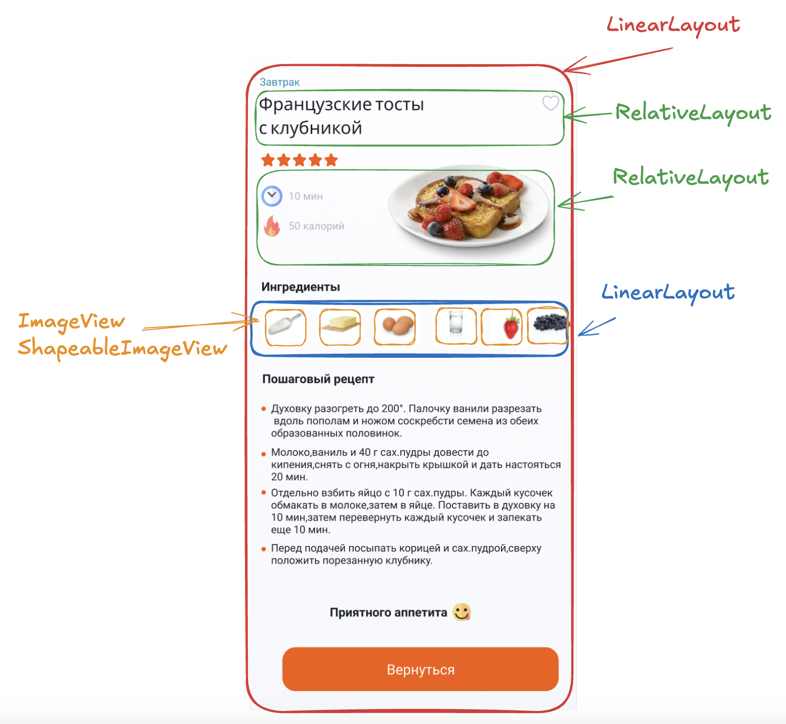

### 🎯 Цели домашнего задания:

Научиться верстать экраны с использованием таких UI-виджетов как CardView, CheckBox, RatingBar и другие.

- Научиться верстать UI с помощью основных UI - виджетов
- Понимать разницу между различными видами Layout
- Добавлять обработку нажатия/ввода текста виджетам
- Научиться создавать стили для виджетов и кастомизировать CheckBox

### 📝  Домашнее задание

В первую очередь предлагается сверстать карточку рецепта в отдельном xml-файле (так будет проще), потом уже использовать эту верстку в главном экране (просто скопировать)
- Создать отдельный xml-файл (например recipe_card.xml) 
- Сверстать дизайн карточки рецепта, которая используется на главном экране, используя рассмотренные виджеты (LinearLayouts, RelativeLayouts, Checkbox, CardView, TextView, ImageView etc)
- Создать отдельную Activity, назвать DetailedActivity и сверстать макет для отображения детальной информации о рецепте.
- Сверстать макет главного экрана (MainActivity). При нажатии на карточку рецепта необходимо реализовать переход на DetailedActivity
- Создать чекбокс в виде сердечка, использовать созданный CheckBox на карточке рецепта и детальном экране, логировать при нажатии на CheckBox статус (true/false)

Итоговый результат показан на схеме:

### 📝  Подсказки для верстки

Схема верстки главного экрана

Схема верстки ячейки рецепта

Схема верстки детального экрана

### 📚 Полезные материалы:

- Timber https://github.com/JakeWharton/timber
- **Памятка по жизненному циклу Android — часть I.** https://habr.com/ru/articles/569092/
- Документация по **жизненному циклу Activity** https://developer.android.com/reference/android/app/Activity#ActivityLifecycle
- Документация по стилям https://developer.android.com/develop/ui/views/theming/themes#Styles
- Отличная статья про стили и темы в Android https://habr.com/ru/companies/redmadrobot/articles/461201/
- Стили Material https://m2.material.io/components/text-fields/android#theming-text-fields
- ShapeableImageView
- https://www.howtodoandroid.com/shapeableimageview-material-components-android/
- Добавление selectors https://stackoverflow.com/questions/3192173/change-icons-of-checked-and-unchecked-for-checkbox-for-android/3193127#3193127
- Как создать Activity https://startandroid.ru/ru/uroki/vse-uroki-spiskom/58-urok-21-sozdanie-i-vyzov-activity.html
- Как открыть новую Activity https://stackoverflow.com/questions/16641643/how-to-add-new-activity-to-existing-project-in-android-studio