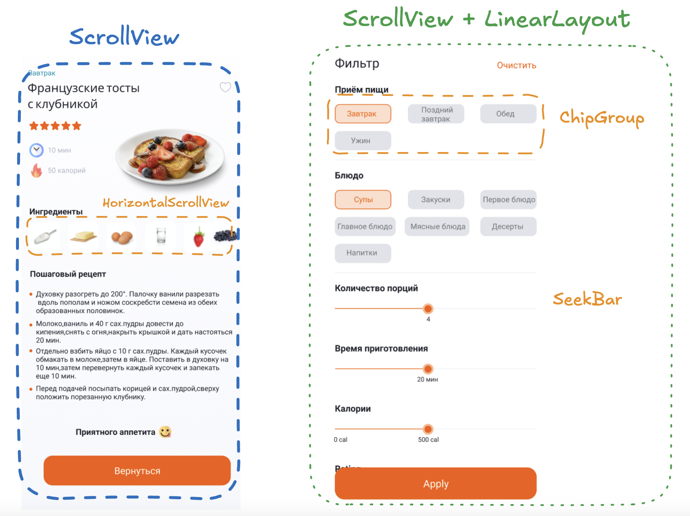

### 🎯 Цели домашнего задания:

Научиться верстать экраны с использованием таких UI-виджетов как Chip, ChipGroup, ScrollView и другие.

- Научиться верстать UI с помощью основных UI - виджетов
- Использовать Chip и ChipGroup
- Добавлять обработку нажатия на ChipGroup
- Научиться создавать стили для виджетов SeekBar

### 📝  Домашнее задание

На данном этапе у вас уже должен быть сверстан экран детального описания рецепта. В это задании вы доработаете этот экран и создадите экран фильтров
- Доработать экран детального отображения рецепта:
- - Обернуть экран детального отображения в ScrollView, использовать HorizontalScrollView для отображения ингридиентов
- Создать отдельную Activity, назвать FilterActivity и сверстать макет для отображения фильтров
- - Использовать Chip и ChipGroup для отображения типов блюд с singleSelection
- - Использовать SeekBar для отображения компонента позволяющего фильтровать блюда по времени и каллорийности
- Добавить BottomNavigationView в MainActivity (activity_main.xml) и добавить листенеры для нажатия элементов меню

### 📝  Подсказки для верстки

Схема верстки детального экрана и фильтров

### 📚 Полезные материалы:

- Документация по Chip https://github.com/material-components/material-components-android/blob/master/docs/components/Chip.md#filter-chip
- BottomNavigation https://github.com/material-components/material-components-android/blob/master/docs/components/BottomNavigation.md
- Документация по стилям https://developer.android.com/develop/ui/views/theming/themes#Styles
- Отличная статья про стили и темы в Android https://habr.com/ru/companies/redmadrobot/articles/461201/
- Стили Material https://m2.material.io/components/text-fields/android#theming-text-fields
- Добавление selectors https://stackoverflow.com/questions/3192173/change-icons-of-checked-and-unchecked-for-checkbox-for-android/3193127#3193127
- Как создать Activity https://startandroid.ru/ru/uroki/vse-uroki-spiskom/58-urok-21-sozdanie-i-vyzov-activity.html
- Как открыть новую Activity https://stackoverflow.com/questions/16641643/how-to-add-new-activity-to-existing-project-in-android-studio