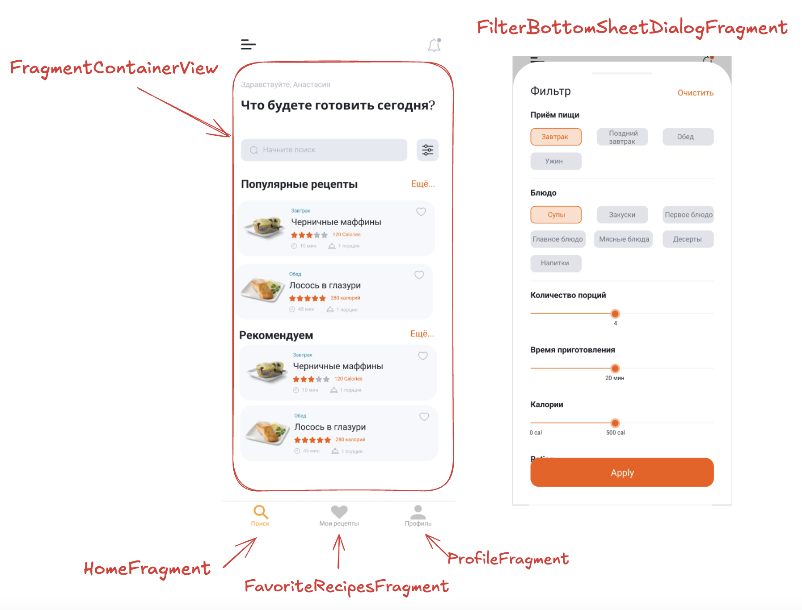

### 🎯 Цели домашнего задания:

- Научиться создавать фрагменты
- Научиться использовать SupportFragmentManager для открытия и навигации между фрагментами
- Передавать данные между фрагментами
- Использовать BottomSheetFragment

### 📝  Домашнее задание
- Создать контейнер внутри Activity для отображения фрагментов
- Создать 3 фрагмента: HomeFragment, FavoriteFragment, ProfileFragment, перенести соответствующую верстку из Actvity во фрагменты
- Добавить в Listener для BottomNavigationView переключение между фрагментами, используя SupportFragmentManager
- Создать BottomSheetDialogFragment, перенести xml-верстку для фильтров из FilterActivity
- Создать стиль и применить его для BottomSheetDialogFragment, чтобы дизайн фрагмента выглядел как на макете
- Добавить передачу выбранных пользователем настроек фильтров из BottomSheetDialogFragment в HomeFragment

### 📝  Подсказки для верстки

Схема фрагментов

### 📚 Полезные материалы:

- Создание фрагмента https://developer.android.com/guide/fragments/create
- Fragment Lifecycle https://developer.android.com/guide/fragments/lifecycle
- Fragment Manager https://developer.android.com/guide/fragments/fragmentmanager
- BottomNavigation https://github.com/material-components/material-components-android/blob/master/docs/components/BottomNavigation.md
- Fragment Results API https://developer.android.com/guide/fragments/communicate#fragment-result