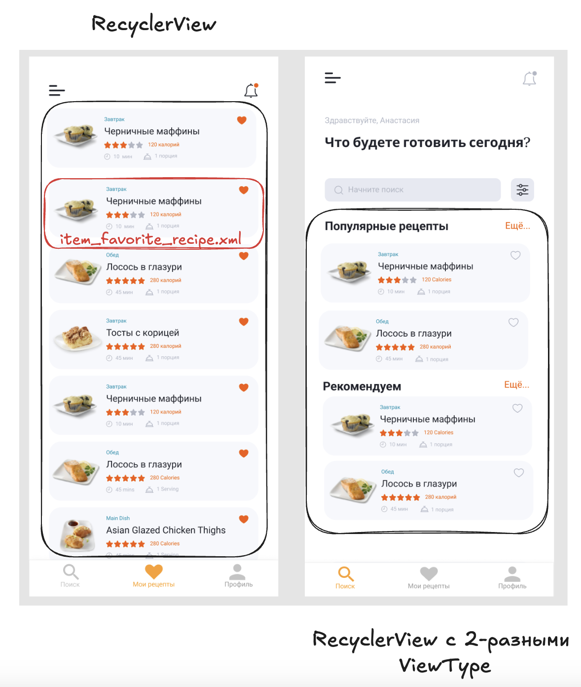

### 🎯 Цели домашнего задания:

Научиться использовать RecyclerView для отображения большого количества элементов на экране. 

- Научиться создавать Adapter и ViewHolder
- Использовать различные типы LayoutManagers (LinearLayoutManager, GridLayoutManager etc)

### 📝  Домашнее задание

В этом домашнем задании необходимо использовать RecyclerView для отображения избранных рецептов на экране Мои Рецепты и на главном (первая вкладка) экране.

- Добавить виджет RecyclerView на фрагменте отображения списка избранных рецептов
- Сверстать элемент ячейки рецепта для отображения в списке (item_favorite_recipe.xml)
- Создать Adapter, принимающий список рецептов в качестве аргументов конструктора
- Создать класс ViewHolder, использовать findViewById() для получения ссылок на виджеты ячейки
- Переопределить методы onBindViewHolder, onCreateViewHolder(), getItemsCount()
- Отобразить список рецептов на экране с исопльзованием RecyclerView и Adapter
- Передать обработчик (Listener) на нажатие ячейки и осуществить переход на детальный экран описания рецепта
- Передать список мок-рецептов, используя Мок-репозиторий созданный в уроке 2 (позже рецепты будут вычитываться из локальной базы данных)

### 📝  Порядок действий

Схема верстки экранов


0) Добавить RecyclerView в build.gradle.kts [Пример объявления зависимостей](https://developer.android.com/jetpack/androidx/releases/recyclerview?hl=ru#declaring_dependencies)

1) Добавить виджет RecyclerView на фрагменте отображения списка избранных рецептов. Пример:

```xml
<?xml version="1.0" encoding="utf-8"?>
<FrameLayout xmlns:android="http://schemas.android.com/apk/res/android"
    xmlns:app="http://schemas.android.com/apk/res-auto"
    xmlns:tools="http://schemas.android.com/tools"
    android:id="@+id/main"
    android:layout_width="match_parent"
    android:layout_height="match_parent">

    <androidx.recyclerview.widget.RecyclerView
        android:id="@+id/movies_list"
        android:layout_width="match_parent"
        android:layout_height="wrap_content"
        android:orientation="vertical"
        app:layoutManager="androidx.recyclerview.widget.LinearLayoutManager" />

</FrameLayout>
```

2) Сверстать элемент ячейки рецепта для отображения в списке (item_favorite_recipe.xml). Пример

```xml
<?xml version="1.0" encoding="utf-8"?>
<LinearLayout xmlns:android="http://schemas.android.com/apk/res/android"
    xmlns:tools="http://schemas.android.com/tools"
    android:layout_width="match_parent"
    android:layout_height="wrap_content"
    android:background="@color/red"
    android:orientation="vertical"
    android:padding="16dp">

    <TextView
        android:id="@+id/title_textview"
        android:layout_width="wrap_content"
        android:layout_height="wrap_content"
        android:textColor="@color/white"
        tools:text="Some Title" />

    <TextView
        android:id="@+id/description_textview"
        android:layout_width="wrap_content"
        android:layout_height="wrap_content"
        android:textColor="@color/white"
        tools:text="Some Long Description" />

    <TextView
        android:id="@+id/rating_textview"
        android:layout_width="wrap_content"
        android:layout_height="wrap_content"
        android:textColor="@color/white"
        tools:text="5" />
</LinearLayout>
```
3) Создать класс ViewHolder. Пример:

```kotlin

class MovieViewHolder(v: View) : RecyclerView.ViewHolder(v) {
    internal var title = v.findViewById<TextView>(R.id.title_textview)
    internal var description = v.findViewById<TextView>(R.id.description_textview)
    internal var rating = v.findViewById<TextView>(R.id.rating_textview)
}
```
4) Создать класс Adapter,  переопределить методы onCreateViewHolder, onBindViewHolder, getItemCount()

```kotlin
class MoviesAdapter(val movies: List<Movie>): RecyclerView.Adapter<RecyclerView.ViewHolder>() {

    override fun onCreateViewHolder(parent: android.view.ViewGroup, viewType: Int): RecyclerView.ViewHolder {
       val view = LayoutInflater.from(parent.context).inflate(R.layout.item_movie, parent, false)
       return MovieViewHolder(view)
    }

    override fun onBindViewHolder(holder: RecyclerView.ViewHolder, position: Int) {
       val myViewHolder =  holder as MovieViewHolder
        myViewHolder.title.text = movies[position].title
        myViewHolder.description.text = movies[position].description
        myViewHolder.rating.text = movies[position].rating.toString()
    }

    override fun getItemCount(): Int {
        return movies.size
    }
}
```
5) Добавить Adapter в recyclerView во фрагменте

```kotlin
    recyclerView.adapter = MoviesAdapter(moviesList)
```


### 📚 Полезные материалы:

- Документация по RecyclerView https://developer.android.com/develop/ui/views/layout/recyclerview?hl=en
- Пример приложения с RecyclerView https://github.com/android/views-widgets-samples/tree/main/RecyclerViewKotlin/
- Туториал по RecyclerView https://guides.codepath.com/android/using-the-recyclerview
- Теория по RecyclerView https://www.youtube.com/watch?v=2-TIYJRkypk 
