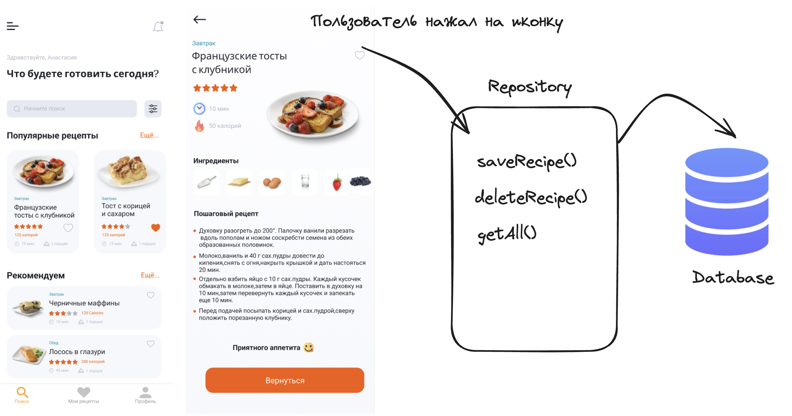

# Кэширование локальных данных в Android-приложениях
✅Учимся кэшировать локальные данные в Android-приложении
В этом занятии вы разработаете локальную базу данных, используя популярную библиотеку Room. Изучим основы работы с ORM Room. Поговорим о различных способах хранения локальных данных в Android-приложении

## В результате:
- Изучите основы работы ORM Room, а также основные аннотации: Entity, DAO, Database
- Сможете локально хранить данные
- Использовать Shared Preferences
- Строить связи 1 ко многим
- Использовать паттерн Repository

### 🎯 Цели домашнего задания:

В этом домашнем задании необходимо локально хранить любимые рецепты пользователя.

- Ознакомиться с кэшированием данных через SharedPreferences и ORM Room.
- Реализовать Entity, DAO, Database и репозиторий
- Реализовать добавление данных рецепта в БД
- Научиться создавать связи 1 ко многим

### 👨Пользовательский сценарий:

Я как пользователь при просмотре списка рецептов хочу отметить любимые рецепты и в дальнейшем иметь быстрый доступ к ним в отдельной вкладке.

### 📚 Задание:

- Описать Entity для хранения информации о рецепте в БД. Описать необходимые поля в Entity для того, чтобы сохранить их и отобразить позже
- Описать методы DAO для получения данных. DAO должен уметь: получить список всех рецептов, сохранить выбранный рецепт в БД, удалить рецепт из БД.
- Описать Database для хранения рецептов и создать метод инициализации БД.
- Реализовать отдельный класс Repository, который должен обращаться к DAO, содержащий все необходимые методы (сохранить рецепт/удалить рецепт/получить список рецептов)
- Прописать метод для сохранения рецептов из UI, которые понравились пользователю
- Вычитывать данные из БД, используя Repository и DAO и отображать список на странице любимых рецептов в RecyclerView

### Схема сохранение данных о рецепте:

### Схема получения списка избранных рецептов:

